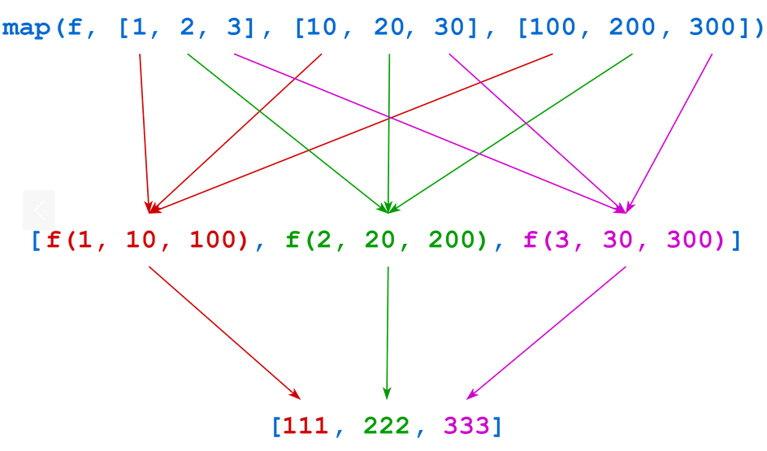

A Python alapvetően nem funckionális nyelv, de vannak olyan funkciók. A funkcionális programozás egy
olyan paradigma, aminek az elsődleges működése függvényhiváson és kiértékelésen alapul szemben a 
procedurális megközelitéssel. Pythonban ugyan kis szerep jut ennek a megközelitésnek, mégis érdemes 
ismerni, arra is láunk majd példát, hogy milyen helyzetekben egyszerűsitheti a kódunkat és/vagy 
életünket.Ezeket fogjuk röviden áttekinteni.

# Mi a funkcionális programozás?

Egy tiszta függvény (pure function) egy olyan függvény, aminek a kimenet csak és kizárólag a bemenetétől
függ. A számitás ezek után ilyen függvények egymásba ágyazásából, illetve komponálásból áll.

A funkcionális paradigma előnyei, hogy
- magas szintű, azaz az eredményt irjuk le, amit kapni szeretnénk és nem a lépéseket, ahogy megkapjuk,
- átlátható, mert csak pure function-öket használ,
- párhuzamositható, megintcsak azért, mert pure function-ök nem okoznak olyan mellékhatásokat, amelyek ezt megnehezitenék.

# Mennyire támogatja a Python a funkcionális programozást?

Ahhoz, hogy a funckionális programozás támogatott legyen egy nyelvben, a függvényeknek két tulajdonsággal
kell birjanak:
- Fogadjanak függvényeket, mint argumentum (erre láttunk [példát](https://github.com/sandor-lokos/szkriptnyelvek_docs/blob/main/functions.md#függvény-mint-argumentum)
- Téritsen vissza függvényt a meghivonak

Pythonban a függvények is objektumok, minden amit meg lehet tenni számokkal, azt meg lehet tenni függvényekkel is.
Például egy változó kaphat függvényt értékként:
```python
def func():
	print("I am function func()!")

func()
another_name = func
another_name()
```
Ennek a kimenete
```
I am function func()!
I am function func()!
```
Be lehet tenni listába vagy dictionary-ba is
```python
def func():
	print("I am function func()!")

print("cat", func, 42)

objects = ["cat", func, 42]
objects[1]
objects[1]()

d = {"cat": 1, func: 2, 42: 3}
d[func]
```
A kompozit függvényekre már láttunk [példát](https://github.com/sandor-lokos/szkriptnyelvek_docs/blob/main/functions.md#függvény-mint-argumentum)
de egy érdekeset azért megnézünk itt is.
```python
animals = ["ferret", "vole", "dog", "gecko"]
sorted(animals, key=len)
```
A kimenet
```
['dog', 'vole', 'gecko', 'ferret']
```
*Feladat*: mi lenne a kinenet a `key=len` nélkül?

Még érdekesebb és absztraktabb:
```python
animals = ["ferret", "vole", "dog", "gecko"]
sorted(animals, key=len, reverse=True)

def reverse_len(s):
	return -len(s)
sorted(animals, key=reverse_len)
```
A kimenet
```
['ferret', 'gecko', 'vole', 'dog']
['ferret', 'gecko', 'vole', 'dog']
```
Figyeljük meg a negativ előjel hatását és azt, hogy a `reverse_len(s)` tulajdonképpen egy függvényt 
térit vissza.

# A `lambda` függvény

A funckionális programozás természete, hogy sok függvényt definiálunk és azokkal operálunk. A függvényeket
a már látott módon a `def` kulcsszóval is definiálhatjuk, de van amikor kényelmesebb úgynevezett `lambda`-t
használni. Ez egy névtelen függvény amit csak egyszer használunk. Az általános szintaxis a következő:
```python
lambda <parameter_list> : <expression>
```
Egy egyszerű példa
```python
square = lambda s : s**2
print(square(8))

def sq(a):
	return a**2
print(sq(8))
```
*Feladat*: a paraméterek helyén, vesszővel elválasztva több paraméter is állhat. Implementáljuk a két szám
átlagát kiszámitó `lambda` kifejezést.

Az előző részben látott `reverse_len` függvényt is irhatjuk `lambda` formába.
```python
animals = ["ferret", "vole", "dog", "gecko"]
sorted(animals, key=lambda s: -len(s))
```
Sőt, egy `lambda` kifejezést úgy is hivható, mint egy függvény
```python
(lambda x: (x, x ** 2, x ** 3))(3)
(lambda x: [x, x ** 2, x ** 3])(3)
(lambda x: {1: x, 2: x ** 2, 3: x ** 3})(3)
```
*Feladat*: magyarázzuk meg a különbséget a kimenetek között!


# Függvényalkalmazás iterálható objektumokra, a `map()`

Iterálható objektumok, a lista és a hozzá hasonlók, általában indexeiken keresztül hozzáférhetőek
és módosithatóak. A `map()` egy olyan funkciót biztosit, amivel ez egyszerűsithető. A szintaxis:
```python
map(<f>, <iterable>)
```
Legyen a példa egy függvény, ami meg tudja forditani az elemek sorrendjét egy tömbben:
```python
def reverse(s):
	return s[::-1]
reverse("String")
```
Kimenet:
```
gnirtS
```
Ezt a függvényt definiált alkalmazhatjuk listára is a `map` segitségével
```python
animals = ["cat", "dog", "hedgehog", "gecko"]
iterator = map(reverse, animals)
iterator
```
de ez, amint látszik egy `iterator`-t ad vissza. A forditott listához hozzá lehet férni vagy egy `for`-ral
vagy a `list()` függvénnyel.
```python
iterator = map(reverse, animals)
list(iterator)
```
A kimenet:
```
['tac', 'god', 'gohegdeh', 'okceg']
```
*Feladat*: Mit is látunk a kimeneten?

Persze nem kell a függvényt külön definiálnunk, használhatunk `lambda`-t is:
```python
animals = ["cat", "dog", "hedgehog", "gecko"]
iterator = map(lambda s: s[::-1], animals)
list(iterator)
```

De akár minden beirhatunk egy sorba:
```python
list(map(lambda s: s[::-1], ["cat", "dog", "hedgehog", "gecko"]))
```
Arra kell csak figyelni, hogy feltettük, hogy a tömbben csak stringek vannak.

*Feladat*: Implementáljuk a fenti egysoros kifejezést "hagyományos" módon!

A `map()` több iterálható objektumra is hivható. Ekkor az alábbi ábra szerint fognak az elemek az új
tömbbe kerülni.
```python
def f(a, b, c):
	return a + b + c
	
list(map(f, [1, 2, 3], [10, 20, 30], [100, 200, 300]))
```



# Elemek válogatása iterálható objektumokból, a `filter()`

# Egy iterálható objektumok redukciója egy értékre, a `reduce()`