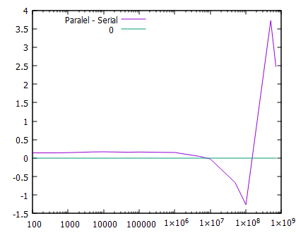

Ha egy feladatot, amit korábban egy processzorral sorosan végeztünk el több, kisebb alfeladatra osztunk,
akkor általában párhuzamos programozásról beszélünk. Így nem csak egy, hanem akár az összes processzorunkat, 
magot a processzorban igénybe tudjuk venni, persze csak akkor ha a kód jól van megírva.

Azt várjuk, hogy a párhuzamosítástól a kódunk gyorsabb lesz, de ez nem mindig alakul így, mert a folyamat
előkészítése is igényel időt, amely ha összemérhető a nyerhető idővel, nem fogunk nyereséget tapasztalni.
Tegyük fel, hogy nincs más/jobb megoldás, mint a párhuzamosítás. Ekkor is még háromféle eset lehetséges:
- Tökéletes: minden folyamat (thread, szál) függetlenül fut
- Memória megosztott: a folyamatok nem teljesen függetlenek, közös memóriaterületet használhatnak
- Kommunikáló: futás közben szükséges az információcsere, a folyamatok futása függ egymástól
Mi csak az első pontbeli helyzettel fogunk találkozni.

Pythonban van több modul is, amivel párhuzamos programozást lehetséges, mi a `multiprocessing` fogjuk
használni. Ezt nem szükséges telepíteni. A példakód a következő 
```python
from multiprocessing import Pool 
import time
import math 

N = 5000000

def cube(x):
	return math.sqrt(x)
	
if __name__ == "__main__": 
	# first way, using multiprocessing 
	start_time = time.perf_counter()
	with Pool() as pool:
		result = pool.map(cube, range(10,N)) 
	finish_time = time.perf_counter()
	print("Program finished in {} seconds - using multiprocessing".format(finish_time-start_time))
	print("---") 
	# second way, serial computation
	start_time = time.perf_counter()
	result = [] 
	for x in range(10,N):
		result.append(cube(x))
	finish_time = time.perf_counter()
	print("Program finished in {} seconds".format(finish_time-start_time))
```

Az első három sorban importáljuk a párhuzamositáshoz szükséges modulokat. Aztán definiálunk egy függvényt 
és egy `N` nevű változót amit a teszt során használunk majd. Ezután következik a furcsa if: 
`if __name__ == "__main__":` Erről már beszéltünk a [vezérlési szerkezeteknél](https://github.com/sandor-lokos/szkriptnyelvek_docs/blob/main/statements.md#egy-furcsa-if-statement----az-ifname--main-idiom).
A lényeg ezen az `if`-en belül található. A teszt miatt definiáljuk a kezdeti időt majd létrehozzuk a 
"worker"-ök egy Poolját. Ez annyi worker-t inicializál, ahány mag elérhető. Egyébként specifikálni is lehet 
a használt magok számát `with Pool(4) as pool:` vagy `with Pool(processes=4) as pool:` de ez nem kötelező.
Akkor érdemes meggondolni, ha egy sokáig futó kód mellett a gépünket másra is akarjuk használni és meg 
szeretnénk legalább egy magot tartani. Az eredményt a `result` nevű változóban tároljuk, ebben a kódban nem 
használjuk fel semmire, de lehetne. A kód többi része a probléma soros megközelitéses verzióját mutatja.
Azon a laptopon, amin teszteltem a fenti kódot a CPU kihasználtság a következőképpen alakult `N = 100000000`
esetén:



Fontos megjegyezni, hogy nem mindig éri meg a párhuzamositás. Az alábbi ábra azt mutatja, hogy változik a
futási időkülönbség az N függvényében. Az is látszik, mikor fogy el a hardware-es forrás a laptopból,
amint a kód futott.


